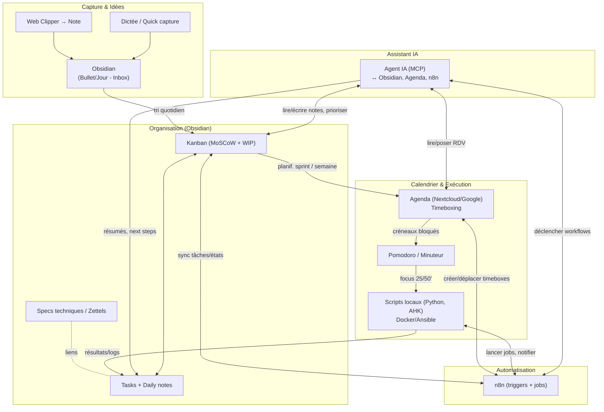
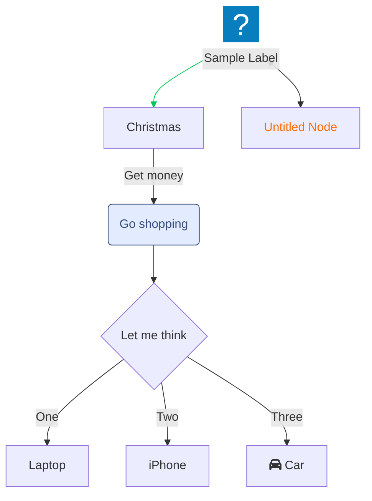

### 1) Architecture générale (flux & rôles)

**Lecture rapide :**
- **Capture** des idées partout ⇒ **Inbox Obsidian**.
- **Organisation** : Kanban avec priorisation **MoSCoW** + limites **WIP**.
- **Planif** : le Kanban pousse des créneaux **Timeboxing** dans l’Agenda.
- **Exécution** : tu travailles par **Pomodoro**, les **scripts** s’exécutent et renvoient leurs logs dans les notes.
- **Automatisation** : **n8n** synchronise états & crée les événements.
- **Agent IA (MCP)** : lit tes notes/tâches, **propose la prochaine action**, **bloque un créneau**, **lance un workflow**, et **résume**.

# Exemples Mermaid

