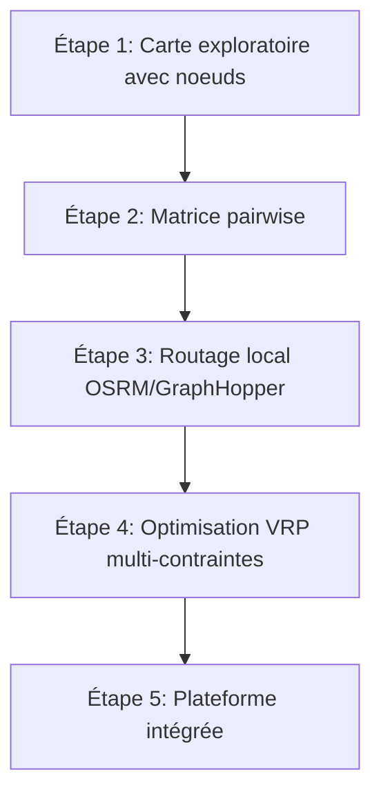

# 📍 Projet Covoiturage GLOM – Roadmap évolutive (niveau doctorant)

## Introduction

L’ambition de ce projet est de concevoir un environnement **Gratuit, Libre, Open‑source et Multiplateforme (GLOM)** destiné à la **planification, la visualisation et l’optimisation de schémas complexes de covoiturage**. Le contexte applicatif inclut plusieurs foyers parentaux, de nombreux élèves et deux établissements scolaires, ce qui génère une combinatoire élevée en termes de contraintes spatiales et temporelles.

L’approche retenue s’appuie sur une progression incrémentale : partir d’outils élémentaires de visualisation, puis intégrer progressivement des algorithmes de routage et d’optimisation de type **Vehicle Routing Problem (VRP)** enrichis de contraintes capacitaires et temporelles. L’objectif est d’articuler théorie et implémentation afin de construire un prototype robuste et évolutif.

---

## Concepts théoriques et technologiques

- **Représentation cartographique** : les entités (parents, élèves, écoles) sont modélisées comme des points géoréférencés (noeuds). La visualisation peut être réalisée via **Leaflet** ou **QGIS**.
- **Géocodage** : conversion des adresses textuelles en coordonnées géographiques. Sources possibles : **Nominatim (OSM)**, **Geoapify**, **Mapbox**, etc.
- **Routage** : calcul des plus courts chemins et des temps de trajet sur graphes routiers.
  - **OSRM** (Open Source Routing Machine) : moteur C++ très performant pour calculs de matrices.
  - **GraphHopper** : moteur Java supportant multimodalité (voiture, vélo, transports collectifs).
- **Optimisation VRP** : résolution d’un problème d’optimisation combinatoire avec contraintes de capacité et fenêtres temporelles.
  - **Google OR‑Tools** : solveur libre reposant sur la programmation linéaire et la recherche locale guidée.
- **Visualisation et analyse** :
  - **Leaflet** : librairie web interactive.
  - **QGIS** : Système d’Information Géographique (SIG) pour analyses exploratoires.

---

## Roadmap évolutive

### 🚀 Étape 1 – Visualisation exploratoire

- **Outil** : QGIS (SIG desktop) ou Leaflet (interface web minimale).
- **Tâche** : placement des noeuds (adresses géocodées) sur une carte.
- **Objectif scientifique** : établir un premier corpus de données géospatiales.

### 🗺️ Étape 2 – Distances et trajets élémentaires

- **Ajout** : API Google Maps ou OSRM public.
- **Tâche** : calcul pairwise des distances et temps de trajet.
- **Objectif scientifique** : obtenir une matrice de coûts pour une instance réduite.

### 🔄 Étape 3 – Routage déterministe local

- **Ajout** : OSRM ou GraphHopper déployé via Docker.
- **Tâche** : calcul de matrices de distances exhaustives.
- **Objectif scientifique** : disposer de données fiables, indépendantes des services tiers, pour l’évaluation expérimentale.

### 🤝 Étape 4 – Optimisation VRP multi‑contraintes

- **Ajout** : OR‑Tools.
- **Tâche** : résolution de VRP avec contraintes capacitaires (sièges disponibles), temporelles (horaires école) et multi‑dépôts (plusieurs écoles).
- **Objectif scientifique** : générer des solutions quasi‑optimales et analyser leur robustesse.

### 🌐 Étape 5 – Plateforme intégrée

- **Outils** : application web modulaire (frontend React/Leaflet, backend Python/Flask ou Node.js).
- **Tâche** : développement d’une interface utilisateur collaborative avec fonctionnalités d’import/export (CSV, PDF, ICS).
- **Objectif scientifique** : démontrer la transférabilité d’un prototype académique vers un usage opérationnel communautaire.

---

## Schéma de progression

---

## Proposition de sprints

1. **Sprint 1 – Mise en place de la base cartographique**

   - Importer un jeu d’adresses (CSV).
   - Géocoder et visualiser via QGIS/Leaflet.

2. **Sprint 2 – Calcul de distances simples**

   - Intégration API Google Maps ou OSRM public.
   - Génération d’une matrice pairwise sur un échantillon réduit.

3. **Sprint 3 – Déploiement local OSRM/GraphHopper**

   - Installation via Docker.
   - Calcul de matrices sur l’ensemble du dataset.

4. **Sprint 4 – Implémentation VRP avec OR‑Tools**

   - Formalisation des contraintes (capacités, horaires, dépôts multiples).
   - Génération et évaluation de solutions.

5. **Sprint 5 – Développement plateforme intégrée**

   - Backend Flask/Node.js pour gérer les calculs.
   - Frontend React/Leaflet pour l’interface utilisateur.
   - Exports (PDF, ICS, CSV).

---

## Glossaire et ressources

- **Leaflet** : librairie JS de cartographie web ([site](https://leafletjs.com), [GitHub](https://github.com/Leaflet/Leaflet), [docs](https://leafletjs.com/reference.html)).
- **QGIS** : SIG libre ([site](https://qgis.org), [GitHub](https://github.com/qgis/QGIS), [docs](https://docs.qgis.org)).
- **OSRM** : moteur de routage OSM ([site](http://project-osrm.org), [GitHub](https://github.com/Project-OSRM/osrm-backend), [docs](http://project-osrm.org/docs/v5.24.0/api/)).
- **GraphHopper** : moteur de routage Java ([site](https://www.graphhopper.com), [GitHub](https://github.com/graphhopper/graphhopper), [docs](https://github.com/graphhopper/graphhopper/blob/master/docs/web/api-doc.md)).
- **OR‑Tools** : solveur d’optimisation Google ([site](https://developers.google.com/optimization), [GitHub](https://github.com/google/or-tools), [docs](https://developers.google.com/optimization/reference/overview)).
- **Nominatim** : service de géocodage OSM ([site](https://nominatim.org), [GitHub](https://github.com/osm-search/Nominatim), [docs](https://nominatim.org/release-docs/)).

---

## Bibliographie indicative

- Clarke, G., & Wright, J. W. (1964). *Scheduling of vehicles from a central depot to a number of delivery points*. Operations Research, 12(4), 568–581.
- Laporte, G. (2009). *Fifty Years of Vehicle Routing*. Transportation Science, 43(4), 408–416.
- Dantzig, G. B., & Ramser, J. H. (1959). *The Truck Dispatching Problem*. Management Science, 6(1), 80–91.
- Bast, H., Delling, D., Goldberg, A., Müller‑Hannemann, M., Pajor, T., Sanders, P., Wagner, D. (2016). *Route Planning in Transportation Networks*. In *Algorithm Engineering*, 19–80.
- Documentation officielle des projets : Leaflet, QGIS, OSRM, GraphHopper, OR‑Tools.

---

## Conclusion

Cette roadmap enrichie inclut désormais un **plan de sprints**, un **glossaire détaillé avec ressources officielles**, et une **bibliographie indicative**. L’ensemble forme un guide complet, combinant dimensions théoriques et pratiques, pour structurer un projet doctoral en optimisation et géomatique appliquée au covoiturage.

