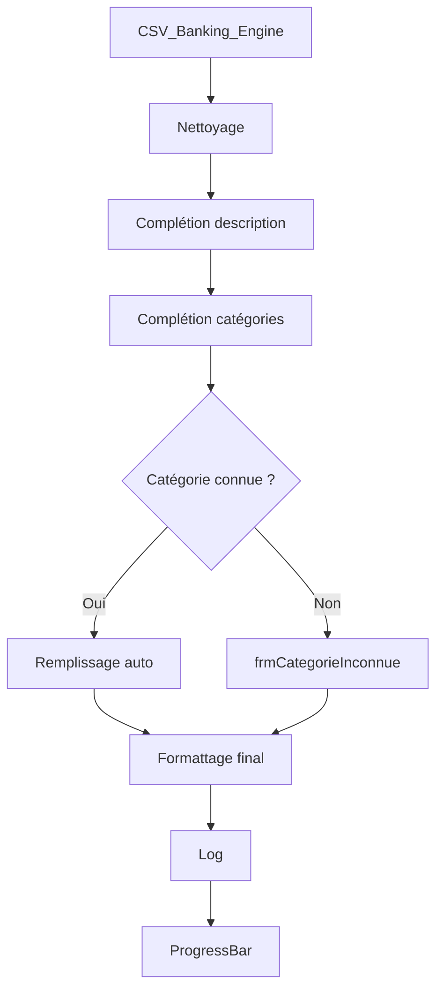

# Carouan_Excel_Complement_DEV_V2

## Objectif
Automatiser l'importation et le traitement de relevés bancaires CSV dans Excel avec nettoyage, catégorisation semi-automatique, logs, visualisation du traitement et UI.

## Modules
- **modUtils** : fonctions utilitaires comme FindCol
- **modNettoyage** : nettoyage des colonnes
- **modDictionnaires** : chargement & recherche de catégories/comptes
- **modFormats** : mise en forme finale
- **modLogsEtSuivi** : log des étapes, suivi de traitement
- **modNewMain** : moteur principal
- **frmProgress** : barre de progression
- **frmCategorieInconnue** : sélection manuelle de catégorie

## Workflow (schéma Mermaid)

