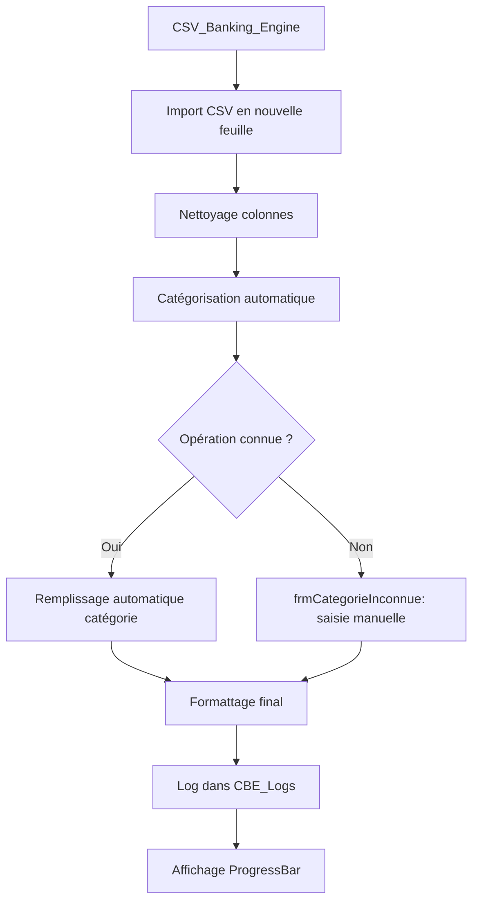

### Projet : Carouan_Excel_Complement_DEV_V2

#### Objectif global :
Automatiser et enrichir le traitement des extraits bancaires CSV dans un fichier Excel avec catégorisation semi-automatique, nettoyage, log, UI, et visualisation.

---

### Fonctionnalités principales :

1. **Import CSV bancaire**
   - Importation et traitement automatique des fichiers CSV (BE…_Inconnu.csv).
   - Fusion, nettoyage et homogénéisation des colonnes.

2. **Nettoyage des lignes**
   - Suppression ou réécriture de valeurs spécifiques.
   - Conversion de format pour colonnes "Montant" et "Date".

3. **Catégorisation semi-automatique**
   - Basée sur des dictionnaires (catégories, comptes, etc.)
   - Étape interactive via UserForm `frmCategorieInconnue` si l'opération est inconnue.

4. **Formattage final**
   - Mise en forme esthétique et cohérente (tailles, alignements, formats comptables/date).

5. **Logs d'exécution**
   - Feuille `CBE_Logs` avec suivi des étapes et des erreurs.
   - Mémorisation des lignes déjà traitées (colonne "Etapes OK").

6. **UI visuelle : ProgressBar**
   - `frmProgress` : indique visuellement l'état d'avancement du traitement.

7. **Architecture modulaire**
   - Modules séparés pour `Main`, `Nettoyage`, `Formats`, `Utils`, `Dictionnaires`, `LogsEtSuivi`.

1. **Inspection et méthodologie Rubberduck**
   - Utilisation de l'add-in Rubberduck pour inspection du code, unit tests, réfactors, etc.

---

### Modules et composants

#### Feuilles Excel
- `CBE_Logs` : feuille de log masquée, affiche les étapes passées
- `Feuil2`, `Feuil3`... : fichiers importés depuis CSV
- `DicoCategories`, `DicoComptes`... : dictionnaires de référence

#### Formulaires
- `frmCategorieInconnue` : UI pour demander la catégorie d'une ligne
- `frmProgress` : UI de barre de progression

#### Modules principaux
- `modMain` : point d'entrée CSV_Banking_Engine, pilotage général
- `modNettoyage` : fonctions de nettoyage des données texte
- `modFormats` : application du formattage final (taille, date, montant)
- `modLogsEtSuivi` : gestion des logs, mémorisation des étapes
- `modDictionnaires` : chargement et recherche dans les dicos
- `modUtils` : fonctions utilitaires comme `FindCol`

---

### Exemple de workflow

---

### Exemples de fonctions utiles

#### `FindCol(ws As Worksheet, colName As String) As Long`
> Renvoie l'index de colonne contenant "colName" (ou 0 si non trouvé).

#### `Formattage_Final(ws As Worksheet)`
> Met en forme les colonnes "Date", "Montant", l'en-tête et ajuste la largeur.

#### `ExecuterEtape(ws As Worksheet, e As Etape) As Boolean`
> Exécute une étape, met à jour la barre de progression, loggue réussite/échec.

---

### To-Do ou idées à envisager
- [ ] Export HTML ou PDF des logs finaux
- [ ] Fenêtre récapitulative des opérations inconnues
- [ ] Ajout de tests unitaires RubberDuck
- [ ] Éventuelle généralisation du moteur pour d'autres banques

---

### Crédit & Auteur
Ce projet a été conçu par Sébastien Baudoux pour l'automatisation de la comptabilité d'une ASBL.
Il s'appuie sur une structure modulaire VBA, optimisée pour la maintenance et l'évolutivité.

---
---
---

# Plan de Refactorisation

## Objectifs

- Factoriser la fonction principale `CSV_Banking_Engine`
    
- Centraliser les constantes et les variables globales
    
- Extraire la gestion des erreurs dans un gestionnaire unique
    
- Uniformiser les noms des modules et des fonctions
    
- Optimiser le chargement des dictionnaires (éventuellement via classe)
    

## Étapes

1. Créer un module `modConstantes` pour stocker les étapes, noms de colonnes, noms de feuilles
    
2. Extraire chaque étape (Nettoyage, Extraction, Catégorisation, etc.) dans une fonction `ExecuterEtape`
    
3. Uniformiser les noms des fonctions (verbes à l'infinitif en PascalCase)
    
4. Éventuellement transformer certains modules en classes (Logs, Dico)  
    """
    

technical_doc_content = """\

# Documentation Technique

## Variables globales

- `Etape` (Enum) : suit les différentes étapes du workflow
    
- `EtapesOK() As Boolean` : tableau de suivi
    

## Fonctions clés

### CSV_Banking_Engine(ws As Worksheet)

- Point d'entrée principal
    
- Affiche la ProgressBar, appelle les 4 étapes, log les statuts
    

### Nettoyage_CSV(ws)

- Supprime lignes vides
    
- Convertit les montants
    
- Supprime les caractères parasites
    

### CompleterColonnes(ws)

- Extrait des infos depuis la description
    
- Ajoute colonnes manquantes
    

### CompleterCategories(ws)

- Tente de catégoriser automatiquement
    
- Appelle `frmCategorieInconnue` si besoin
    

### Formattage_Final(ws)

- Formate les colonnes "Montant", "Date"
    
- Ajuste la largeur et le style
    

### FindCol(ws, colName)

- Recherche la colonne contenant un nom
    
- Retourne son index
    

## Dépendances

- `modUtils` dépend de rien
    
- `modMain` dépend de tous les autres
    
- `frmCategorieInconnue` dépend de `modDictionnaires`