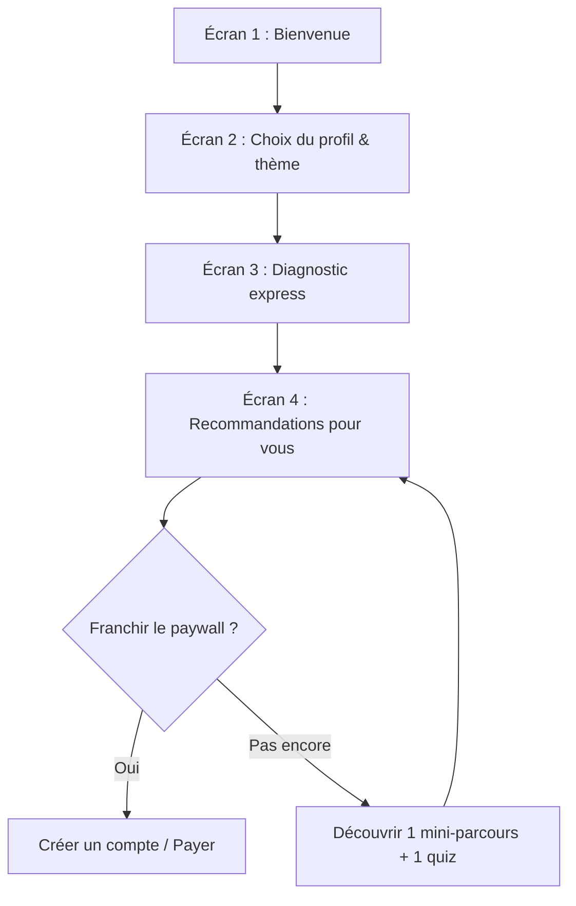

# Plan Freemium & Conversion – Académie de **Femmes de droit**

_Document de travail pour l’équipe FDD (non technique-friendly)_

---

## TL;DR (2 minutes)

- **But** : augmenter le passage “visite ➜ inscription ➜ activation ➜ paiement”.
- **Moyen** : passer d’un **paywall direct** à un **freemium** qui montre clairement la valeur **avant** l’achat.
- **Clé** : un **onboarding** (4 écrans max) qui mène vite au **“moment wow”** (diagnostic perso + recommandations), puis **paywall intelligent**.
- **Pilotage** : mesurer les étapes clés (funnels), grouper les personnes selon leurs étapes (cohortes), tester des variantes (A/B) et relancer par e-mail.
- **Stack GLOM** (Gratuit-Libre-Open-source-Multiplateforme) : **PostHog** (analytics), **Mautic** ou **Listmonk** (emails), **n8n** (automatisation).

---

## 1) Contexte & objectif

L’Académie propose des formations utiles, mais **trop peu de personnes passent à l’achat**.  
Objectif : **démontrer rapidement la valeur** et **réduire les frictions** avec un parcours clair, mesuré et optimisé.

**Indicateurs finaux visés (ordre d’importance)**

1. % d’utilisateurs qui atteignent le **moment “wow”** (activation).
2. Temps médian pour atteindre ce “wow” (**< 90 s**).
3. Taux “Gratuit → Payant” (7 jours / 30 jours).
4. Rétention 7/30 jours (reviennent-ils ?).

---

## 2) Freemium : l’idée en simple

- **Avant** : on bloque rapidement → les personnes ne voient pas la valeur.
- **Après (freemium)** : on **montre un extrait convaincant** (mini-parcours + 2-3 ressources phares + 1 quiz auto-corrigé + un badge gratuit).
- **Puis** un **gating intelligent** : “Vous avez vu X, il en reste Y à débloquer (certificat, ressources avancées, suivi, etc.)”.

**Pourquoi ça marche ?**  
Parce qu’on **vérifie l’intérêt réel** et on **crée une petite frustration positive** : “j’ai déjà appris quelque chose, j’en veux plus”.

---

## 3) Onboarding scénarisé (4 écrans max)

> **Objectif** : amener en quelques clics au **moment “wow”** (diagnostic + recommandations personnalisées), **puis** présenter la version payante.

**Proposition d’écrans (texte prêt à l’emploi)**

- **Écran 1 — Bienvenue** :  
    “Bienvenue à l’Académie de Femmes de droit. En 2 questions, nous vous proposons un mini-parcours adapté à vos besoins. (⏱ 30–60 s)”
- **Écran 2 — Profil & thème** :  
    “Je suis : [Étudiante] [Professionnelle du social] [RH] [Bénévole] [Autre]”  
    “Je cherche surtout : [Prévention des violences] [Droits & démarches] [Sensibiliser mon public] [Former mon équipe]”
- **Écran 3 — Diagnostic express** :  
    “Sur base de vos choix, voici 3 objectifs atteignables cette semaine.”  
    (3 cartes : objectif + durée + résultat attendu)
- **Écran 4 — Recommandations “pour vous” (moment wow)** :  
    “Votre parcours personnalisé :
    1. Mini-module (10 min) → **extrait gratuit**
    2. Quiz (5 min) → **badge découverte**
    3. Ressource téléchargeable → **extrait PDF**  
        ➜ **Débloquez** certificat, modules avancés, suivi & ressources complètes.”

---

## 4) Paywall “frustration intelligente”

- **Montrer** : 1 mini-parcours, 1 quiz complet, 2–3 extraits de ressources.
- **Bloquer** : certificats, contenus experts, ressources complètes, parcours mentoré, historique de progression détaillé.

- **Micro-copie (CTA)** :

    - “Débloquer les 6 ressources restantes”
    - “Obtenir le certificat & l’accompagnement”
    - “Continuer où je me suis arrêté(e) (suivi complet)”

---

## 5) Mesure & pilotage (sans jargon)

### Outil recommandé

- **PostHog** (open-source) : mesure des étapes (**funnels**), regroupements (**cohortes**), **A/B tests**.
- **Respect RGPD** : n’enregistrer **que** le nécessaire. Afficher un bandeau clair. Anonymisation possible. Opt-out simple.
    

### Événements (à “taguer”)

|Événement|Quand on le déclenche|Pourquoi c’est utile|Propriétés attachées (exemples)|
|---|---|---|---|
|`onb_start`|Entrée écran 1|Compter les débuts d’onboarding|`device`, `country`, `lang`|
|`onb_step`|Vue écran 2/3/4|Voir où ça décroche|`step_id` (2/3/4)|
|`diag_ready`|Diagnostic affiché|Valider le “presque wow”|`choices` (profil/thème)|
|`wow_view`|Recos perso visibles|**Activation**|`items_shown` (3/7/50)|
|`free_used`|Mini-parcours/quiz gratuit terminé|Qualité du freemium|`content_id`, `duration`|
|`cta_upgrade_view/click`|Paywall vu/cliqué|Attrait des offres|`cta_variant`|
|`pay_success`|Paiement OK|Conversion finale|`plan`, `amount`, `coupon`|

> **Règle d’or** : peu d’événements mais **parfaits**. Mieux vaut 10 signaux clairs que 50 inutiles.

### Tableau de bord (hebdo)

|KPI|Cible de départ|Interprétation|
|---|---|---|
|Activation = % avec `wow_view`|**> 40 %**|Si bas : revoir écrans 2–3 (trop longs ? pas clairs ?)|
|Time-to-wow (médiane)|**< 90 s**|Si long : préremplir, réduire le texte|
|Free → Paid (7 jours)|+2 à +5 pts|Montre si le freemium convainc|
|Free → Paid (30 jours)|+5 à +10 pts|Effet relances & bouche-à-oreille|
|Taux de complétion mini-parcours|**> 60 %**|Qualité des extraits & UX|

---

## 6) A/B tests concrets (simples à comprendre)

|Test|Hypothèse|Mesure|Décision|
|---|---|---|---|
|**Volume gratuit** (3 vs 7 vs 50 items)|Trop peu ≠ convaincant, trop = plus de frustration|Upgrade 7j, clics|Garder la variante au meilleur upgrade|
|**Moment du paywall** (avant/ après mini-quiz)|Voir une réussite motive à payer|Upgrade 7j|Si “après quiz” surperforme → l’adopter|
|**Micro-copie CTA**|Mieux expliquer ce qui est débloqué|Taux de clic CTA|Conserver le texte gagnant|
|**Preuve sociale** (logos, chiffres, témoignages courts)|Rassure et crédibilise|Upgrade 7j|Garder la version la + performante|
|**Préremplissage** (guidage)|Moins d’effort = plus loin|Time-to-wow, drop step 2→3|Si + rapide et moins de drop → adopter|
|**Email J+0 vs J+1**|Le timing change l’effet|Upgrade 7j|Retenir le meilleur timing|

---

## 7) Emails automatiques (Mautic/Listmonk)

**Déclencheur** : a vu `wow_view` **mais n’a pas payé**.

- **J+0 — “Vous avez déjà gagné X”**  
    _Objet_ : “Vous avez déjà débloqué [résultat], voici la suite possible”  
    _Contenu_ : mini-démo gif, bénéfice concret, bouton **“Débloquer le parcours complet”**
- **J+3 — “Qu’est-ce qui manque ?”**  
    1-click survey (3 objections fréquentes au choix) → renvoi vers une page réponse.
- **J+7 — “Étude de cas courte + offre limitée”**  
    8–10 lignes max, 1 chiffre fort, bouton final.

> Ces emails ne vendent pas “une page web”, ils vendent **le résultat souhaité** (certificat, montée en compétences, conformité, impact terrain).

---

## 8) Outils GLOM (open-source) proposés

- **PostHog** : analytics produit (funnels, cohortes, A/B).
- **Mautic** ou **Listmonk** : emails transactionnels & campagnes.
- **n8n** : automatisations simples (ex : “si `wow_view` et pas `pay_success` sous 3 jours ➜ email J+3”).
- **Matomo** (option) : analytics web classiques (trafic global).

**RGPD & éthique**

- Informer clairement, limiter les données, chiffrer, droit à l’oubli, opt-out accessible.

---

## 9) Rôles & gouvernance (qui fait quoi ?)

- **Porteuse du besoin** (ex. responsable Académie) : valide le contenu visible en freemium et l’offre payante.
- **Référente UX** : simplifie textes/écrans, garantit le **time-to-wow < 90 s**.
- **Référente data** : configure PostHog, tableau de bord hebdo, lit les résultats A/B.
- **Référente contenus** : choisit 1 mini-parcours, 1 quiz, 2–3 ressources “phares”.
- **Référente communication** : écrit les 3 emails (J+0/J+3/J+7), preuve sociale, ton FDD.

---

## 10) Roadmap “2 semaines” (pragmatique)

**Semaine 1**

1. **Jour 1-2** : écrire les 4 écrans (texte court + visuels).
2. **Jour 3** : choisir les 3 contenus freemium (mini-parcours, quiz, ressources).
3. **Jour 4** : définir les événements à taguer (table ci-dessus).
4. **Jour 5** : préparer le tableau de bord (KPI) + micro-copies CTA.

**Semaine 2**

1. **Jour 1** : brancher PostHog + premiers événements.
2. **Jour 2** : lancer 2 **A/B tests** (volume gratuit + micro-copie CTA).
3. **Jour 3** : rédiger les **3 emails** + config Mautic/Listmonk.
4. **Jour 4** : mettre en place l’automatisation n8n (déclencheurs).
5. **Jour 5** : revue d’équipe (30 min) → décisions rapides & prochaines itérations.

---

## 11) Glossaire rapide (anti-jargon)

- **Onboarding** : les premiers écrans qui accueillent et guident la personne.
- **Moment “wow”** : le moment où la personne **voit concrètement la valeur** (diagnostic perso + reco utiles).
- **Freemium** : une **partie gratuite** (limitée) + **partie payante** (complète/avancée).
- **Paywall** : l’écran/élément qui **bloque** l’accès au contenu payant.
- **Funnel** : l’**entonnoir** des étapes (ex : visite → wow → achat).
- **Cohorte** : un **groupe** de personnes ayant vécu la même chose (ex : a fini l’onboarding en octobre).
- **A/B test** : comparer **deux versions** (A vs B) pour garder la meilleure.

---

## 12) Ce qu’on fera **après** (quand la base est solide)

- **Preuves sociales** plus riches (témoignages vidéo courts, logos partenaires).
- **Bundles** (packs thématiques), **offres équipes**, **parcours certifiants**.
- **Publicité payante** (seulement quand conversion organique OK).

---

### Résumé actionnable (checklist)

-  Écrire les 4 écrans d’onboarding (≤ 90 s vers le “wow”).
-  Choisir 1 mini-parcours + 1 quiz + 2–3 ressources en **freemium**.
-  Installer/configurer **PostHog** + 8 événements clés.
-  Mettre en place 2 **A/B tests** simples.
-  Rédiger 3 **emails** (J+0 / J+3 / J+7).
-  Revue hebdo KPI (30 min) → **une amélioration par semaine**.