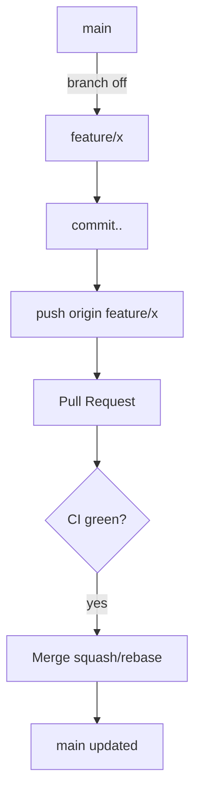
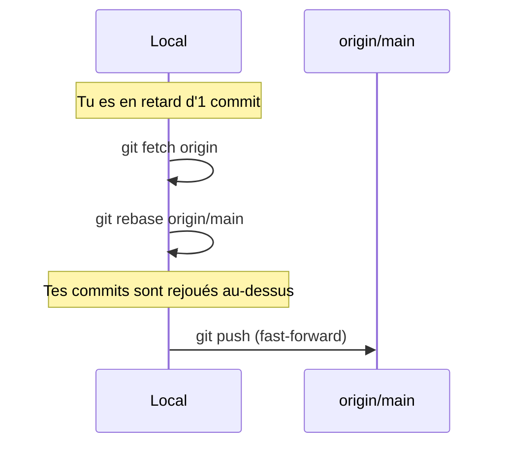
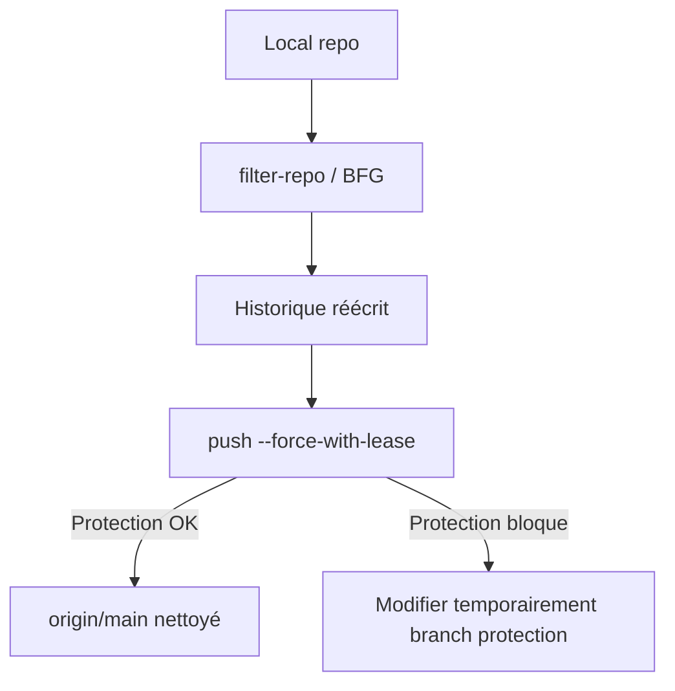

# Git — Guide complet (glossaire, workflows, recettes de secours)

> Objectif : fournir un **document autonome** pour comprendre Git, choisir un **workflow**, et **débloquer** les situations courantes (secrets poussés par erreur, gros fichiers, réécriture d’historique, conflits, sous-dépôts accidentels, etc.).  
> Public : utilisateur avancé (master/doctorant), environnement Windows/WSL/macOS/Linux, GitHub.

---

## 0) Aide‑mémoire « que faire maintenant » (sécurité + nettoyage)

### 0.1 Si des **secrets** ont été poussés (même une fois)

1. **Révoquer/rotater immédiatement** toutes les clés/tokens compromis (GitHub PAT, OpenAI, Atlassian, etc.).  
2. **Supprimer le fichier fautif** de l’historique (pas seulement du dernier commit). Deux options :  
   - **A. Purge par *chemin*** (efface totalement le fichier de tout l’historique) :  
     ```powershell
     # Prérequis : Python 3 + git-filter-repo (ou utilisez BFG, cf. plus bas)
     pip install --upgrade git-filter-repo
     cd "<RACINE_DU_REPO>"
     git filter-repo --force --invert-paths --path "CHEMIN/du/fichier_avec_secrets.md"
     git push --force-with-lease origin main
     ```
   - **B. Remplacement par *pattern*** (si le secret est disséminé dans plusieurs fichiers) :  
     Créez `replacements.txt` :
     ```
     regex:(?i)sk-[a-z0-9]{32,} ==> [REMOVED]         # OpenAI
     regex:(?i)(ghp|github_pat)_[a-z0-9_]{20,} ==> [REMOVED]  # GitHub PAT
     regex:(?i)atlassian.*token.* ==> [REMOVED]       # Atlassian
     ```
     Puis :
     ```powershell
     git filter-repo --force --replace-text .\replacements.txt
     git push --force-with-lease origin main
     ```
   > **Remarque** : si *Branch protection* bloque le *force push*, autorisez temporairement le *force push* sur `main` (Settings → Branches → Rules).

3. **Empêcher la récidive** : ajouter le fichier aux **ignores** et/ou conserver un `secrets.example` :
   ```gitignore
   00_OBSI-CORE/VARIABLES/API Keys.md
   ```
   Conservez localement la version réelle (non suivie), et versionnez une variante *exemple* sans clés.

### 0.2 Si des **gros fichiers** bloquent le push (≥50 Mo)

- **Option A (recommandé)** : ne **pas** versionner ces artefacts → nettoyez l’historique :  
  ```powershell
  git filter-repo --force --invert-paths --path "05_Zettel_VAULT_2.0/chat.html" --path "05_Zettel_VAULT_2.0/conversations.json"
  git push --force-with-lease origin main
  ```
- **Option B (vous tenez à les garder)** : basculez sur **Git LFS** :  
  ```powershell
  git lfs install
  git lfs track "*.html" "*.json"
  git add .gitattributes && git commit -m "chore(lfs): track html/json"
  git lfs migrate import --include="*.html,*.json" --include-ref=refs/heads/main
  git push --force-with-lease origin main
  ```
  > Attention : `migrate import` **réécrit l’historique**. Assurez‑vous qu’aucun collaborateur n’a des clones non synchronisés.

### 0.3 Sous‑dépôts accidentels (dossier avec `.git` à l’intérieur)

```powershell
# À la racine du dépôt
ren "chemin/imbriqué/.git" "_git_BACKUP_$(Get-Date -Format yyyyMMddHHmmss)"
git rm --cached -r -- "chemin/imbriqué" 2>$null
git add -A && git commit -m "fix(repo): remove embedded repo"
git push
```

---

## 1) Glossaire (20+ termes essentiels)

- **Repository (repo)** : base de données des versions d’un projet. Contient l’historique, les refs, l’index et la *working tree*.
- **Commit** : instantané immuable de l’état des fichiers suivis ; possède un *hash* SHA‑1/2, un parent et un message.
- **Tree / Blob** : *tree* = répertoire ; *blob* = contenu d’un fichier à un instant donné.
- **Branch** : pointeur mobile vers un commit (ex. `main`).  
- **HEAD** : référence symbolique vers la branche actuellement checkoutée (ou directement un commit en *detached HEAD*).
- **Index / Staging area** : zone tampon des fichiers (pré‑commit).  
- **Remote** : dépôt distant (ex. `origin`).  
- **Upstream** : branche distante suivie par la branche locale (`main` suit `origin/main`).
- **Fast‑forward** : avancement direct de `main` sur `origin/main` sans merge commit.
- **Merge** : fusionne deux historiques ; peut créer un *merge commit*.
- **Rebase** : rejoue des commits sur une nouvelle base (réécrit l’historique local). Évite les *merge commits* inutiles.
- **Reset** : déplace `HEAD`/l’index/la *working tree*. `--soft` (HEAD), `--mixed` (HEAD+index), `--hard` (HEAD+index+WT).
- **Reflog** : journal local des déplacements de `HEAD` (utile pour récupérer après *reset/rebase* hasardeux).
- **Cherry‑pick** : applique un commit isolé sur la branche courante.
- **Stash** : met de côté des changements non commités (pile locale).
- **Tag** : pointeur immuable vers un commit (souvent versionné).
- **Submodule** : dépôt Git imbriqué, référencé par un *gitlink* (mode `160000`).
- **LFS (Large File Storage)** : système de pointeurs pour stocker les gros fichiers hors du dépôt Git.
- **Filter‑repo / BFG** : outils de réécriture d’historique (purge/masquage de contenus).
- **Protected branch** : règles applicables à une branche (interdiction de *force push*, checks requis, push protection/secrets).

---

## 2) Workflows (schémas Mermaid)

### 2.1 GitHub Flow (simple, recommandé)



### 2.2 Rebase vs Merge (vue locale)



### 2.3 Nettoyage d’historique (secrets/gros fichiers)



---

## 3) Recettes « au quotidien »

- **Initialiser et pousser** :
  ```bash
  git init
  git add -A
  git commit -m "init"
  git branch -M main
  git remote add origin git@github.com:<user>/<repo>.git
  git push -u origin main
  ```
- **Mettre à jour une branche locale** :
  ```bash
  git fetch origin
  git pull --rebase origin main
  ```
- **Annuler le dernier commit, garder les modifs** :
  ```bash
  git reset --soft HEAD~1
  ```
- **Annuler un commit public (crée un commit inverse)** :
  ```bash
  git revert <hash>
  ```
- **Récupérer un fichier effacé (depuis HEAD)** :
  ```bash
  git checkout -- path/du/fichier
  ```
- **Voir ce qui est suivi/ignoré** :
  ```bash
  git ls-files --stage
  git check-ignore -v path/du/fichier
  ```

---

## 4) Débloquer des situations courantes

### 4.1 *non-fast-forward* (rejet du push)
```bash
git fetch origin
git pull --rebase origin main
git push
```

### 4.2 Conflits au rebase
```bash
# résoudre les conflits dans l'éditeur
git add <fichiers_resolus>
git rebase --continue
# abandonner si besoin
git rebase --abort
```

### 4.3 Nettoyer un fichier ou un motif de tout l’historique

- **Par chemin** :
  ```bash
  git filter-repo --force --invert-paths --path "chemin/secret.md"
  git push --force-with-lease origin main
  ```
- **Par motif (secrets)** :
  `replacements.txt` → voir §0.1B, puis :  
  ```bash
  git filter-repo --force --replace-text replacements.txt
  git push --force-with-lease origin main
  ```

### 4.4 Gros fichiers déjà commités
```bash
# solution A : purge totale
git filter-repo --force --invert-paths --path "path/to/big.bin"
git push --force-with-lease origin main
# solution B : basculer en LFS
git lfs install
git lfs track "*.bin"
git add .gitattributes && git commit -m "chore(lfs): track bin"
git lfs migrate import --include="*.bin" --include-ref=refs/heads/main
git push --force-with-lease origin main
```

### 4.5 Sous-modules accidentels
```bash
ren "foo/bar/.git" "_git_BACKUP_$(date +%Y%m%d%H%M%S)"
git rm --cached -r -- "foo/bar"
git add -A && git commit -m "fix: remove embedded repo"
git push
```

### 4.6 Retrouver le fichier correspondant à un **blob id** (GitHub push protection)
```bash
git rev-list --objects --all | grep <BLOBID>
```

### 4.7 *Je veux garder un fichier localement mais ne jamais le committer*
```bash
echo "path/local/secret.txt" >> .gitignore
git update-index --assume-unchanged path/local/secret.txt
```

---

## 5) .gitattributes et fins de ligne (Windows)

```gitattributes
* text=auto
*.md text eol=lf
*.bat text eol=crlf
```
- Windows : `git config --global core.autocrlf true`
- Linux/macOS : `input`

---

## 6) Outils d’histoire : `filter-repo` vs **BFG**

- **git-filter-repo** (Python) – flexible, officiel (successeur de `filter-branch`).  
  `pip install git-filter-repo`
- **BFG Repo-Cleaner** (Java) – très simple pour effacer des fichiers ou secrets littéraux.  
  ```bash
  java -jar bfg.jar --delete-files "API Keys.md" --replace-text replacements.txt
  git reflog expire --expire=now --all && git gc --prune=now --aggressive
  git push --force-with-lease origin main
  ```

---

## 7) Bonnes pratiques

- Commits **atomiques** et messages structurés : `type(scope): message`.
- `pull.rebase=true` par défaut pour un graphe linéaire.
- Pas d’artefacts de build dans Git ; build en CI.
- Secrets hors repo ; variables via `.env` chiffré/gestionnaire de secrets CI/CD.
- `--force-with-lease` (jamais `--force` nu) pour protéger le travail d’autrui.
- Branch protection + checks requis sur `main`.

---

## 8) Références rapides

- `git status`, `git log --oneline --graph --decorate -n 20`
- `git diff`, `git diff --cached`
- `git add -p` (staging hunk par hunk)
- `git restore --staged <f>` / `git restore <f>`
- `git switch -c feature/x` / `git switch main`
- `git bisect` (trouver le commit fautif)
- `git blame` (dernière modification d’une ligne)

---

*Fin.*
