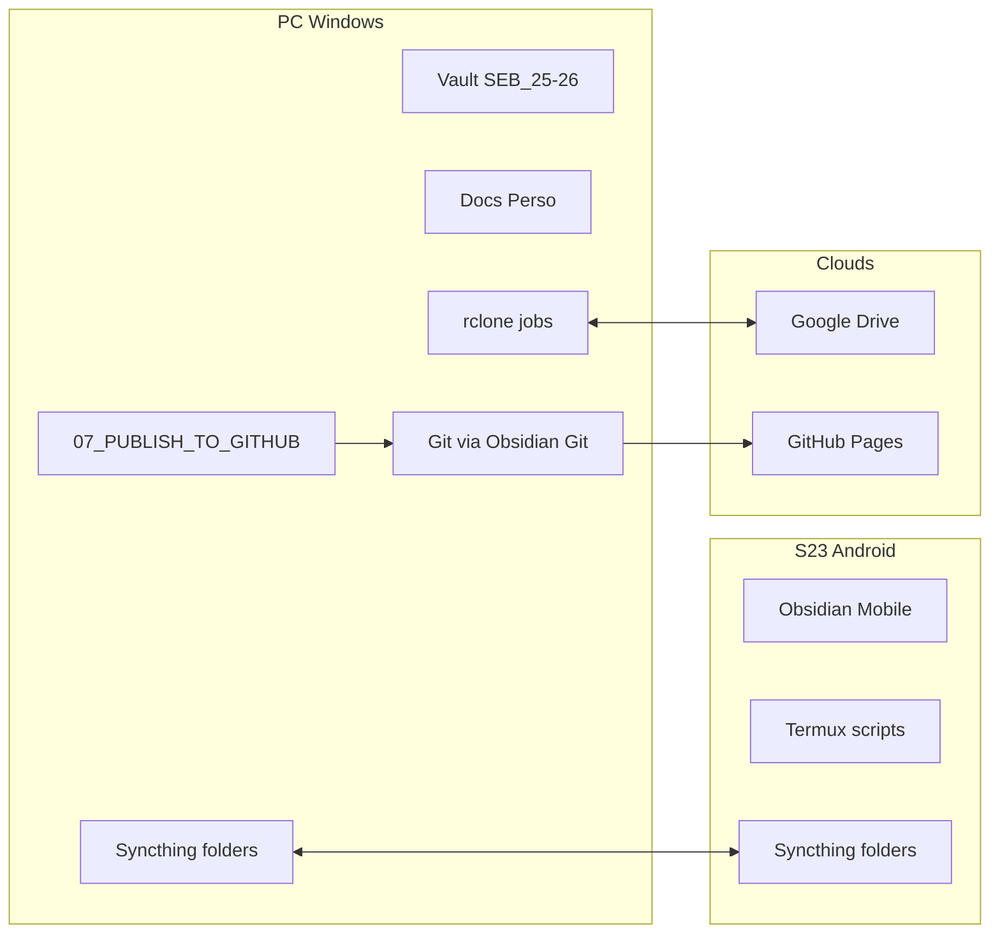

# 🗺️ Vue d’ensemble
Objectif : **orchestrer** la synchro et la publication de *plusieurs dossiers* (Vaults Obsidian et autres) entre **laptop Windows**, **Android (S23)**, **Google Drive**, et **GitHub**, avec un contrôle **fin** dossier‑par‑dossier.



---

# 🧱 Arborescence recommandée (PC)

```
D:\Data\
│
├─ Vaults\
│   └─ SEB_25-26\
│       ├─ 00_Inbox\
│       ├─ 02_Notes_Cours\
│       ├─ 05_Media\
│       └─ 07_PUBLISH TO GITHUB\      # publié sur GitHub Pages
│
├─ SyncMobile\
│   ├─ Obsidian_Shared\                # dossiers Obsidian à partager via Syncthing
│   └─ Media_Shared\
│
└─ DriveBridge\
    ├─ Publications\                   # dossiers destinés à Drive (via rclone)
    └─ Archives\
```

> Pourquoi séparer ? Pour éviter que Syncthing et Drive se battent sur **le même chemin** ; on fait transiter par `DriveBridge\` et on pousse avec **rclone**.

---

# 📦 Dossiers à créer côté Android (S23)

```
/storage/emulated/0/Obsidian/SEB_25-26/   # cible des dossiers Obsidian partagés
/storage/emulated/0/SyncMobile/           # autres dossiers utiles
```

---

# 🔧 Outils à installer

## PC (Windows)
- **Syncthing** (service au démarrage)  
- **Git for Windows** (+ OpenSSH)  
- **Obsidian** + plugin **Obsidian Git**  
- **rclone** (optionnel GUI: `rclone rcd --rc-web-gui`)  
- (Option) **FreeFileSync** si tu veux du local↔local en GUI

## Android (S23)
- **Syncthing‑Android** (ou Syncthing‑Fork) — autoriser batterie/stockage  
- **Obsidian Mobile**  
- **Termux** + `pkg install git openssh` (clé SSH dans `~/.ssh`)  

---

# ⚙️ Paramétrage Syncthing (par folder)

| Folder (PC) | Chemin | Android | Type | Notes |
|---|---|---|---|---|
| **VaultInbox** | `D:\Data\Vaults\SEB_25-26\00_Inbox` | `/Obsidian/SEB_25-26/00_Inbox` | Send & Receive | Travail bi‑directionnel |
| **VaultCours** | `D:\Data\Vaults\SEB_25-26\02_Notes_Cours` | `/Obsidian/SEB_25-26/02_Notes_Cours` | Send & Receive | Id. |
| **VaultMedia** | `D:\Data\Vaults\SEB_25-26\05_Media` | — | Send Only | Évite de saturer le mobile |
| **VaultPublish** | `D:\Data\Vaults\SEB_25-26\07_PUBLISH TO GITHUB` | `/Obsidian/SEB_25-26/07_PUBLISH TO GITHUB` | **Send Only (PC)** / Receive Only (Android) | Le PC est le “maître” |
| **DocsPerso** | `D:\Data\Docs Perso` | `/SyncMobile/Docs` | Send & Receive | Dossier non‑Obsidian |

- **Versioning** : activer sur **PC** (Keep last 20).  
- `.stignore` : placer un fichier adapté à chaque folder (modèle dans la fiche *Synchronisation globale*).

---

# ☁️ Pont Google Drive avec rclone

## Remote rclone (une fois)
```bash
rclone config   # créer remote "gdrive:" (Google Drive)
```

## Job typique (PC → Drive)
```bat
rclone sync "D:\Data\DriveBridge\Publications" gdrive:Publications ^
  --exclude ".git/**" --exclude "site/**" --exclude "public/**" ^
  --transfers 4 --checkers 8 --fast-list
```
Planifier via **Planificateur de tâches** (par ex. toutes les 2h).

---

# 🧭 Git & Publication

## Obsidian Git (PC)
- _Auto backup interval_ : 5–10 min  
- _Pull before push_ : ON  
- `.gitignore` : propre (voir modèle)  
- Repo : `Carouan/PPV_S56` (SSH)

## Android (Termux)
Script `~/bin/obsidian-sync.sh` :
```bash
#!/data/data/com.termux/files/usr/bin/bash
set -e
VAULT="$HOME/storage/shared/Obsidian/SEB_25-26/07_PUBLISH TO GITHUB"
cd "$VAULT"
git pull --rebase
git add -A
git commit -m "mobile(auto): $(date '+%F %T')" || true
git push origin main
```
Planification : `crond` (ou déclenchement Tasker à l’ouverture/fermeture d’Obsidian).

---

# 🧪 Contrôles & alertes

- **Diff Git** régulier (Obsidian Git / Show Diff).  
- **Syncthing** : vérifier les **“Failed items”** et conflits.  
- **rclone** : logs dans un fichier (`--log-file path\to\log.txt --log-level INFO`).  

---

# ✅ Checklist finale

- [ ] Tous les folders Syncthing créés et appairés, `.stignore` ok.  
- [ ] Git push/pull ok (PC et Android).  
- [ ] rclone planifié vers Drive (sélectif).  
- [ ] Aucune cohabitation Syncthing/Drive sur le **même chemin**.  
- [ ] Publication GitHub Pages opérationnelle pour `07_PUBLISH TO GITHUB`.  
